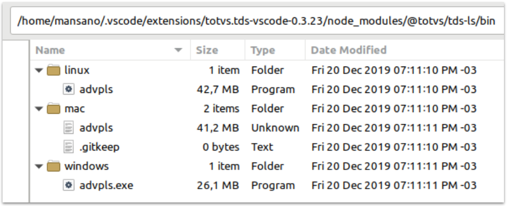

# TDS-CLI (LS)

O _**TDSCLI-LS**_ (_**C**ommand **L**ne **I**nterface_ **L**anguage **S**erver) é uma ferramenta do ecossistema **TOTVS Protheus** que permite ações como a compilação e aplicação de patchs via linha de comando.

## Obtendo a ferramenta

### A partir do GitHub

Acesse a página de (Liberações)[https://github.com/totvs/tds-ls/releases], localize a versão desejada e salva o pacote do executável adequado ao seu sistema operacional.

> Não há processo de instalação. Os binários são portáteis.

> Para uso em modo legado (compátivel com **TDScli-Eclipse**), use também os arquivos de [comandos em lote](./legado).

### NodeJS

Uso geral:

`npm -G install @totvs/tds-ls`

Associado a um projeto específico:

`npm install @totvs/tds-ls [--save-dev]`

Via extensão TDS-VSCode

O **AdvPLS**, também está disponível no diretório da extensão do **TDS-VSCode** para os três sistemas operacionais homologados, conforme exemplo abaixo.



> Mais informações sobre a extensão [TDS-VSCode](https://marketplace.visualstudio.com/items?itemName=totvs.tds-vscode).

## Utilizando o AdvPLS

### Modos de execução

```
> advpls
Usage: advpls.exe [options] mode
Performs the LS actions via command line interface (CLI).

Options:
  -?, -h, --help                Displays help on commandline options.
  --help-all                    Displays help including Qt specific options.
  -v, --version                 Displays version information.
  --wait-for-attach <seconds>   Wait <seconds> to start execution. Debug
                                purpose only.
  --verbose <level>             Verbose execution.
  --log-all-to-stderr           Forward all messages (Except INFO messages) to stderr (error console
                                standard).
  --log-file <filename>         Log file.
  --log-file-append <filename>  Log append file.
  --record                      Enable record communication details.
  --wait-for-input              Wait for an '[Enter]' before exiting. Debug
                                purpose only.

Arguments:
  mode                          Execution mode
                                (language-server|cli|appre|tds-cli).
```

| Argumentos | Uso |
| - | -|
| `mode`| Indica como o `advpls` será utilizado.|
| | `language-server`, como servidor em segundo plano, usando protocolo LS e comunicação via `stdin` e `stdout`.|
| | `cli`, executa arquivos de (_script_)[TDS-cli-script.md] que contém uma sequência de ações.|
| | `appre`, executa processo de pré-compilação, sem depender de um servidor Protheus (ações limitadas).|
| | `tds-cli`, executa em modo de compatibilidade com o **TDScli-Eclipse**.|

> Estas opções são válidas para todos os modos de execução.

> Opções não documentadas ou com propósito de depuração, devem ter seu uso usados com cautela.

| <a name="generalOptions">Opções | Uso geral (todos os modos) |
| - | - |
| -?, -h, --help| Apresenta descritivo das opções.|
| -v, --version| Apresenta a versão.|
| --verbose \<level>| Nível de informação a ser apresentada durante execução.|
| --log-all-to-stderr| Envia todas as mensagens para a saída padrão de erro (console).|
| --log-file <filename>| Arquivo de registro de ocorrências.|
| --log-file-append| Indica que informações de nova execução devem ser anexadas as já existentes.|
| --record| Habilita o detalhamento da comunicação.|

## Modo _language-server_

A execução, normalmente, ocorre em segundo plano (_backgroud_), utilizando o console padrão (_stdin_ e _stdout_) para comunicação usando o [protocolo de servidor de linguagem (LSP do inglês)](https://microsoft.github.io/language-server-protocol/).

Pode ser utilizado em editores e _IDE_ que suportam o protocolo.

```
> advpls.exe language-server --help
Usage: advpls.exe [options] language-server
Performs the LS actions via command line interface (CLI).

Options:
  --auth-request, --authRequest    Auth request arguments. Debug purpose only.
  --check-sm                       Check SM. Debug purpose only.
  --enable-auto-complete <enable>  EnableAutoComplete option.
  --notification-level <level>     Notification level.
  --fs-encoding <code-page>        File System encoding page.
  --includes <includeList>         Include folder list.
  --linter <linter>                Enable linter.

Arguments:
  language-server                  Language Server(background) execution mode.
```

| Argumentos | Uso |
| - | - |
| `language-server` | Como servidor em segundo plano, usando protocolo LS e comunicação via `stdin` e `stdout`.|

| Opção | Uso |
| - | - |
| \<options> | Opções de [uso geral](#generalOptions). |
| --enable-auto-complete| Habilita o modo do auto-complementar pelo servidor.|
| --notification-level \<level>| Nível das notificações a serem enviadas ao editor/IDE.<br>`none`, nenhuma notificação;<br>`only errors`, somente erros;<br>`errors and warnings`, erros e avisos;<br>`errors warnings and infos`, erros, avisos e informações;<br>`all`, informações detalhadas incluindo de depuração;|
| --fs-encoding \<code-page>| Código de página utilizado pelo sistema de arquivos.<br>`CP1252`, `CP1251` ou `UTF-8`|
| --includes \<includeList>| Lista de pastas para busca de arquivos de definição, separadas por ponto-e-vírgula (`;`).|
| --linter| Habilita [pré análise]([https://github.com/totvs/tds-vscode/blob/master/docs/linter.md) de arquivos-fontes.|

## Modo _cli_

A execução nesse modo permite executar múltiplas ações em uma única chamada através da execução de um [_scriptFile_](TDS-cli-script.md), por exemplo:

- Conexão ao _AppServer_ (action=**authentication**);
- Compilação de um conjunto de fontes (**compile**);
- Defrag do RPO (**defragRPO**)

```
W:\ws_tds_vscode\tds-ls\bin\windows>advpls.exe cli --help             
Usage: advpls.exe [options] cli <scriptFile>
Performs the LS actions via command line interface (CLI).

Options:

Arguments:
  cli                          Script execution mode.
  scriptFile                   Script file.
```

| Argumentos | Uso |
| - | - |
| `cli` | Executa arquivos de (_script_)[TDS-cli-script.md] que contém uma sequência de ações.|

| Opção | Uso |
| - | - |
| \<options> | Opções de [uso geral](#generalOptions). |

## Modo _appre_

A execução nesse modo permite efetuar um pré-processamento nos arquivos-fontes, compilando-o e gerando o arquivo intermediário `.ppo` ou equivalente. Esse modo não depende de conexão prévia a um _appServer_.

```
>advpls.exe appre --help 
Usage: advpls.exe [options] appre source[,..]
Performs the LS actions via command line interface (CLI).

Options:
  -I, -i <folder>              Include folder.
  -D, -d <define>              Direcitve define, eg. /DTOP

Arguments:
  appre                        Appre execution mode.
  source                       Source (file or folder or @<sourceList.txt>).
```

| Argumentos | Uso |
| -|------|
| `appre`| Executa processo de pré-compilação, sem depender de um servidor Protheus (ações limitadas).|
| `source`| Lista de arquivos (ou pastas), separadas por vírgula (``,``).|

| Opções | Uso |
| -| -|
| \<options> | Opções de [uso geral](#generalOptions). |
| -I, -i <folder> | Pasta para busca de arquivos de definição.<br>Pode ser informada uma ou mais vezes. |  
| -D, -d <define> | Define uma constante (similar a diretiva ``#define``) para determinar comportamentos e/ou isolamento de código, p.e. ``/DTOP``.<br>Pode ser informada uma ou mais vezes.

## Modo _tds_cli_

Executa TDScli-LS em modo de compatibilidade (legado) com o **TDScli-Eclipse**.

```
>advpls.exe tds-cli --help 
Usage: advpls.exe [options] tds-cli
Performs the LS actions via command line interface (CLI).

Options:
  --tds-cli-arguments, --tdsCliArguments  TDS CLI arguments (legacy mode).

Arguments:
  tds-cli                                 TDS-CLI execution mode.
```

| Argumentos | Uso |
| -|------|
| `tds-cli` | Executa em modo de compatibilidade com o **TDScli-Eclipse**.|

| Opções | Uso |
| -| -|
| \<options> | Opções de [uso geral](#generalOptions). |
| --tds-cli-arguments | Argumentos compátiveis com o **TDScli-Eclipse**|

# Compatibilidade com **TDScli-Eclipse**

Para utilizar o modo de compatibilidade com **TDScli-Eclipse** usamos arquivos de _script_ (batch/bash), específicos para cada sistema operacional, e apenas uma **ação pode ser chamada por execução**:

> Os _script_ estão disponíveis no repositório [GitHub](./legado).

| Sistema Operacional | Sintaxe |
| - | - | 
| Windows | `> TDScli.bat <action> <parâmetros_da_ação>` |
| Linux | `> ./TDScli.sh <action> <parâmetros_da_ação>` |
| Mac OS | `> ./TDScli.sh <action> <parâmetros_da_ação>` |

## Usando parâmetros em linha de comando

`> TDScli.bat <action> <parametro_da_acao_1> <parametro_da_acao_2> <parametro_da_acao_3>...`

## Usando parâmetros em arquivo

`> TDScli.bat <action> @parametros_da_acao.txt`

> Os parâmetros obrigatórios **dependem da action**, porém em todas as actions os parâmetros de conexão da **action authentication** devem ser informados.

## Exemplo usando **parâmetros em linha de comando**

`> TDScli.bat compile serverType=AdvPL server=localhost port=1234 build=7.00.170117A environment=env user=user psw=pass includes=D:/servers/protheus/includes program=D:/fontes/advpl/prg_0001.prw;D:/fontes/advpl/prg_0002.prw;D:/fontes/advpl/prg_0003.prw authorization=D:/chave_compilacao/chave.aut recompile=t`

## Exemplo usando **parâmetros em arquivo**

`> TDScli.bat compile @compile.txt`

```ini
;compile.txt
;Exemplo de arquivo de execução para o TDScli (legado)

;parametros da acao authentication
serverType=AdvPL
server=localhost
port=1234
build=7.00.170117A
user=user
psw=pass
environment=env

;parametros da acao compile
includes=D:/servers/protheus/includes
program=D:/fontes/advpl/prg_0001.prw;D:/fontes/advpl/prg_0002.prw;D:/fontes/advpl/prg_0003.prw
authorization=D:/chave_compilacao/chave.aut
recompile=t
```
